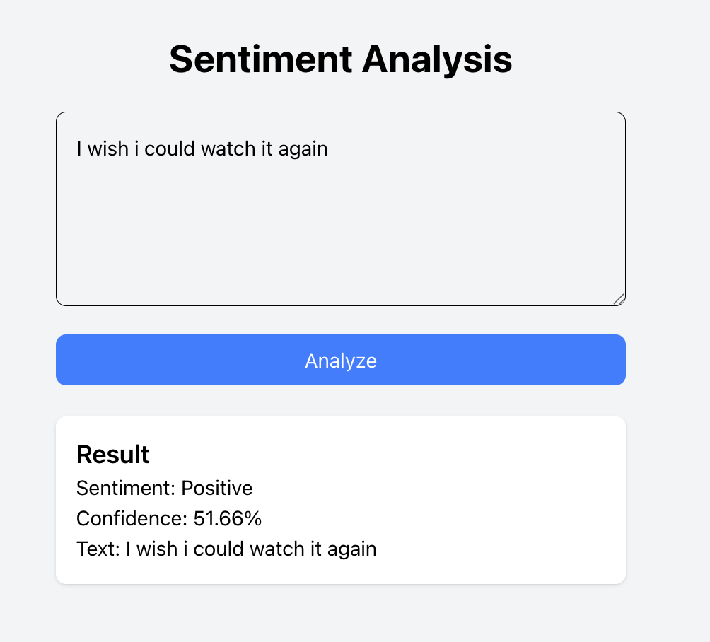

## About the App
---
This is an app that does the sentiment analysis on sending a text in the input box.

---
### Simple fundamentals of Next + PyTorch:
Successful Response:

Error:

---
# NOTE:
- Only a dummy LSTM model is used here (Randomized untrained weights), so the outputs of the mechanism are not at all accurate.
- This is just a project to test next with PyTorch using FastAPI
